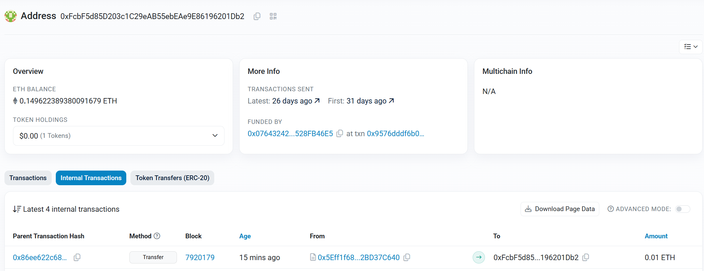

## 内容说明

### 1. 写TokenBank合约 继承 AutomationCompatibleInterface 接口

### 2. 在合约内实现 AutomationCompatibleInterface 的具体逻辑

```solidity
interface AutomationCompatibleInterface {
    function checkUpkeep(bytes calldata checkData) external returns (bool upkeepNeeded, bytes memory performData);
    function performUpkeep(bytes calldata performData) external;
}
```

### 3. 在 https://home.chain.link/ 网注册Upkeep 以TokenBank地址为监控地址,并写入abi的逻辑数据

### 4. 触发条件 观察结果是否正确执行


## 执行成功截图



